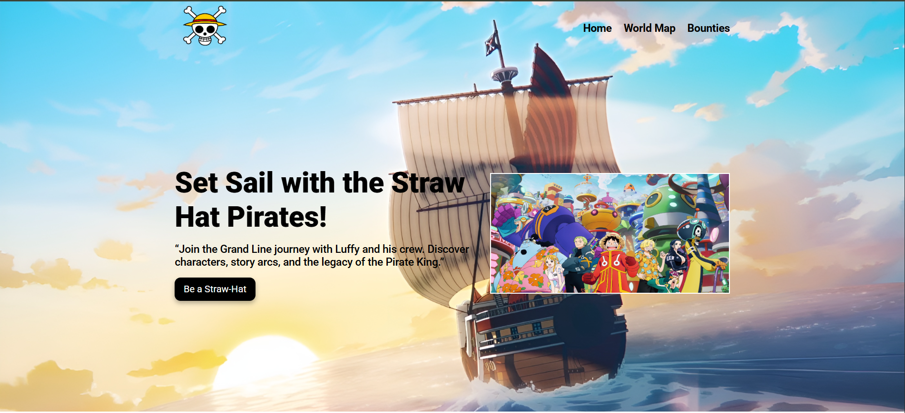

🏴‍☠️ One Piece Tribute Website
Welcome aboard the Going Merry! This is a visually engaging HTML + CSS project dedicated to the legendary anime series One Piece. It’s designed as a landing page to introduce fans to the Straw Hat Pirates, featuring an immersive layout, character cards, quotes, and background audio from the world of pirates!

🚀 Features
🎌 Clean, modern responsive layout

🧭 Navigation bar for smooth section jumps

🏴‍☠️ Hero section introducing the Straw Hat crew

🃏 Interactive character cards for each crew member

📝 Motivational quote from Luffy

🔊 Auto-playing background music with custom play/pause button

🎨 Google Fonts and stylish CSS hover effects

🛠️ Tech Stack
HTML5

CSS3 (Flexbox for layout)

Google Fonts

Audio integration using JavaScript

🌊 Inspiration
Inspired by the rich world of One Piece, this project is a fan-made tribute to celebrate the spirit of freedom, adventure, and friendship embodied by the Straw Hat Pirates.

📸 Preview

📁 How to Use
Clone or download this repo

Open index.html in your browser

Explore the Straw Hat crew and enjoy the vibe!

📬 Feedback
Feel free to fork, remix, or reach out with suggestions. This is a beginner-friendly project and open for enhancements!

⚠️ Disclaimer
This website is a fan-made project created for educational and entertainment purposes only.
All character images, names, and related content belong to their respective owners:
Eiichiro Oda, Toei Animation, and Shueisha.

We do not claim any ownership over the One Piece franchise.
If you are a copyright holder and wish to request content removal, please contact the repository owner.

